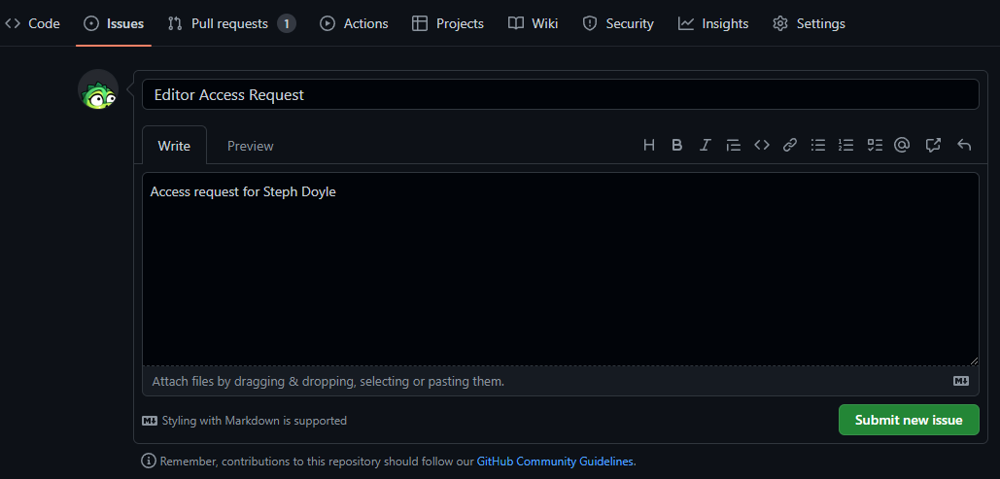
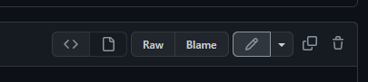
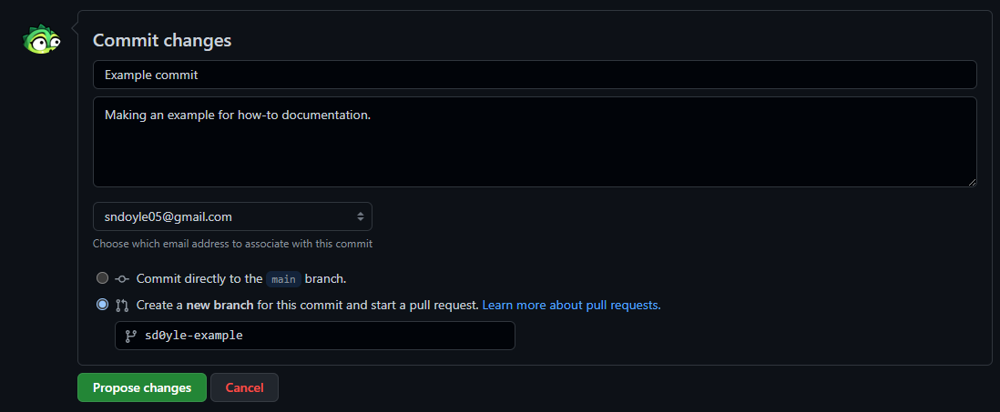
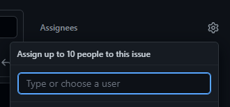

# LARP Chronicles Ruleset v3.0.3

Welcome to the Chronicles rules repo! The main branch of this repo is always the currently-used rules for our game.

If you would like to make any corrections or contributions to the rules documents, please see our section below for detailed steps on how to make edits.

**Contact Information**
[Discord](https://discord.com/invite/Za6eT7sfkV)
[Facebook](https://www.facebook.com/groups/545002000131502)  
Email [plot@larpchronicles.com](mailto:plot@larpchronicles.com)

## How to Contribute to Rules Docs

--
### Step 1 - Have a github account.
If you have an account already, great!  You can skip to Step 2.  If you do not, head over to [https://github.com/signup](https://github.com/signup) where you will be guided through account creation and email validation.

### Step 2 - Request access to edit.
Open [https://github.com/larpchronicles/rules/issues](https://github.com/larpchronicles/rules/issues) and click on the button titled `New Issue`.  Give your issue a title such as "Editor access request".  If your github username does not clearly identify who you are by your player name, please include it in the comment section of your issue.  Click `Submit new issue`.  Now, unfortunately, you must wait for an admin.

Once your access is updated, your issue will be updated, or they may reach out to you directly on Discord to inform you.

Example:


### Step 3 - Start your update!
Return to the repo [https://github.com/larpchronicles/rules](https://github.com/larpchronicles/rules) and determine where you'd like to make edits.  For example, if you click on the folder `rules-topics` you will see several rules sections.  Each of the files listed here represent a section of the rules as a single markdown file.

Select the file you want to edit, and you will be navigated to that file.  You may see it rendered or formatted when it first loads.  To see the actual markdown, you can click on the `< >` button, which will show you the source code.  Clicking the Pencil button will open an editor in your browser.  Now, you can make your changes.



### Step 4 - Committing changes.
Once you have your updates ready, scroll down until you see a section called `Propose changes` or `Commit changes`.  Here, you should create a commit message.  The first box should be a short summary of your change and the second should include any details about your change.

Example:


If you started your edit from the main branch, the radio button to create a new branch will be pre-selected for you.  You may name your branch anything you want, but it is ideal that it be named something related to your edit.

Once you have your commit message ready and you have named your branch, click Propose changes.  This will take you to a pull request screen.  If you have more changes related to your last, you can wait on this step.  However, if you are ready now, move ahead to the next step.

### Step 5 - Pull Requests (PRs)
If your changes are ready for review and you are already on the pull request screen, enter a name your pull request and add a description.  On the right, click the gear icon next to Reviewers and add `jd0yle or sd0yle`.


Click `Create pull request`.  This will notify the assignees to review your edits.  They may update your pull request to approve, reject, or request changes that you will need to complete before your update can be merged.

If your PR is rejected, do not worry!  The rejector has likely left you a message about why on your PR.  You can review it, make changes and open a new PR.

If changes were requested, make any updates needed and update your reviewer for a recheck.

If your PR is approved, the admin will utilize `Squash and Merge` and then delete your branch.  If for some reason they only approve your PR and do not merge it, you may perform this step.  Navigate back to your PR and clicking the arrow next to the `Merge` button and select `Squash and Merge`.  You may be asked to confirm this action.  Once it is complete, you will see a smaller button to `delete branch`.  It is safe to do this at this point.  Congratulations, your changes are now part of the live ruleset!

    Squash and Merge is a merge option that takes what may be a branch of multiple individual edits (commits) and squashes them into a single edit.  This keeps the working tree of the project cleaner and makes it easier to manage.  If you merge without squashing, it is not the end of the world!  This is simply a preferred way to merge.


## Rule Doc Naming Convention

---
Filenames are prefixed with a number that is used to keep the ruleset in order and allow for easy insertion of new sections.
```
##_document-name.md
```
Example:
```
02-check-in.md
```

## Rule Doc Formatting Guidelines

---
```
# Rule Document

## Section Header

---
Content.

### Sub-Section Header
Content.
```
Example:
```
# Armor Rules

## Armor Strike Zones

---
These zones are valid.

### Illegal Strike Zones.
These zones are invalid.
```

## Rule Doc Table Formatting Guidelines

---
Current preference is to use markdown tables, rather than html tables.  When writing markdown tables, the IDE will likely try to correct the format to make it prettier to look at.  This has no effect on how it renders.

Example:
```
| TableHeader | TableHeader2 |TableHeader3|
|:---|:---:|:---:|
|Left-Aligned Content|Centered Content|Centered Content|
|Left-Aligned Content|Centered Content|Centered Content|
```
```
| TableHeader          |   TableHeader2   |   TableHeader3   |
|:---------------------|:----------------:|:----------------:|
| Left-Aligned Content | Centered Content | Centered Content |
| Left-Aligned Content | Centered Content | Centered Content |
```
Both formats will yield the table below:

| TableHeader          |   TableHeader2   |   TableHeader3   |
|:---------------------|:----------------:|:----------------:|
| Left-Aligned Content | Centered Content | Centered Content |
| Left-Aligned Content | Centered Content | Centered Content |
